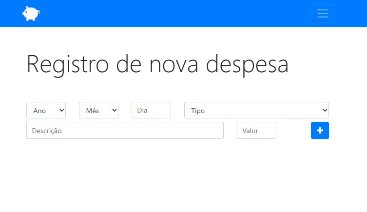
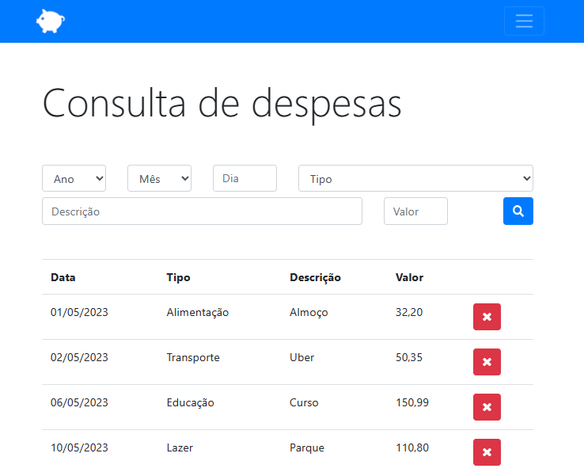
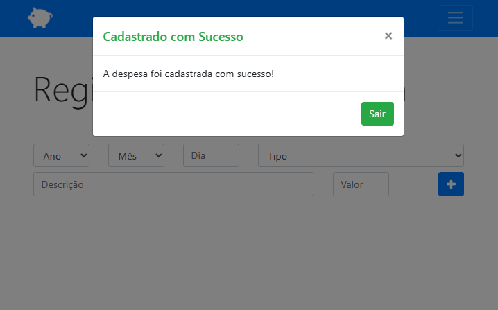

# Personal-budget
Projeto de Aplicativo web para o Controle de Receitas e Despesas


[Acesse aqui Personal-budget](https://paulovitorguedes-personal-budget.netlify.app/)
##### Projeto foi implementado em *HTML*, *CSS*, *BOOTSTRAP* e *JAVASCRIPT*



___
O Aplicativo permite entrar com os dados de despesa contendo a data, tipo descrição e valor. 
A tela de consulta retorna todos os dados cadastrados e permitindo uma pesquisa específica da despesa desejada, cada pesquisa é possivel solicitar mais de uma opção de busca.




### Objetivo
Esse projeto iniciou um desafio para criação de objetos com os atributos da despesa e armazenando na Window localStorage, utilizando JZON para o deslocamento dos dados 

```
localStorage.setItem(this.getProximoId(), JSON.stringify(d));
localStorage.setItem('id', this.getProximoId());
 ```
 
 Um modal informativo com Bootstrap é apesentado para operações realizadas (cadastrar, excluir e falhas na entrada de dados)
 
 
 
 
